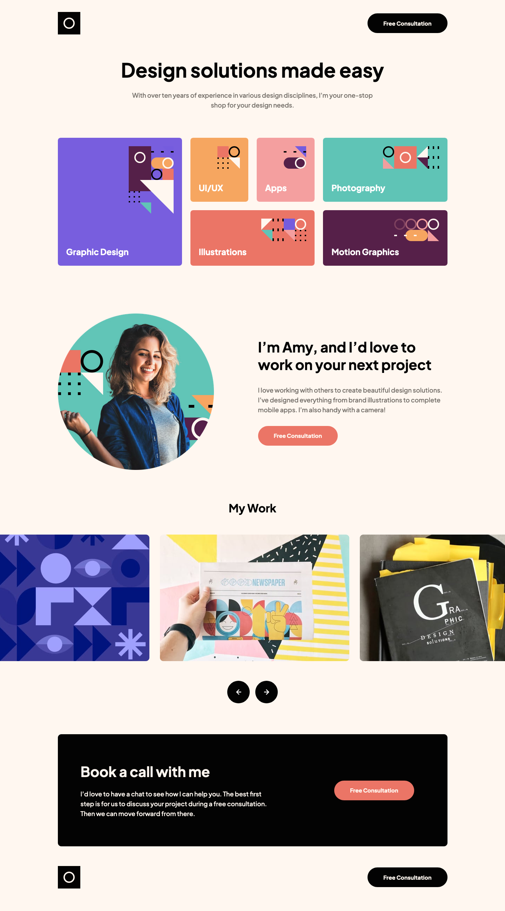

# Frontend Mentor - Single-page design portfolio solution

This is a solution to the [Single-page design portfolio challenge on Frontend Mentor](https://www.frontendmentor.io/challenges/singlepage-design-portfolio-2MMhyhfKVo). Frontend Mentor challenges help you improve your coding skills by building realistic projects.

## Table of contents

- [Overview](#overview)
  - [The challenge](#the-challenge)
  - [Screenshot](#screenshot)
  - [Links](#links)
- [My process](#my-process)
  - [Built with](#built-with)
- [Author](#author)

## Overview

### The challenge

Users should be able to:

- View the optimal layout for the site depending on their device's screen size
- See hover states for all interactive elements on the page
- Navigate the slider using either their mouse/trackpad or keyboard

### Screenshot

### Links

- Solution URL: [https://www.frontendmentor.io/solutions/singlepage-design-portfolio-using-tailwind-css-fVwDmKWv3Y](https://www.frontendmentor.io/solutions/singlepage-design-portfolio-using-tailwind-css-fVwDmKWv3Y)
- Live Site URL: [https://single-page-design-portfolio.netlify.app/](https://single-page-design-portfolio.netlify.app/)

## My process

### Built with

- HTML
- [Tailwind CSS](https://tailwindcss.com/)
- JavaScript
- Mobile-first workflow
- [Vite](https://vitejs.dev/)
- Figma Design File

## Author

- Website - [Nakoya Wilson](https://nakoyawilson.netlify.app/)
- Frontend Mentor - [@nakoyawilson](https://www.frontendmentor.io/profile/nakoyawilson)
- Twitter - [@nakoyawilson](https://twitter.com/nakoyawilson)
- LinkedIn - [@nakoyawilson](https://www.linkedin.com/in/nakoyawilson/)
